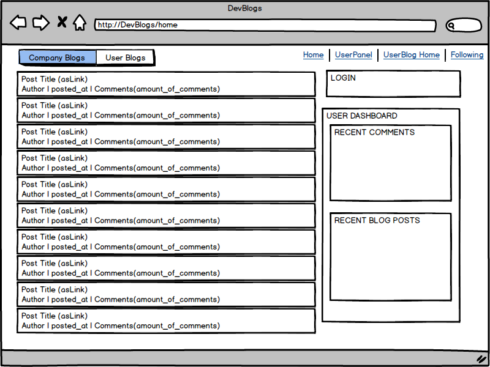
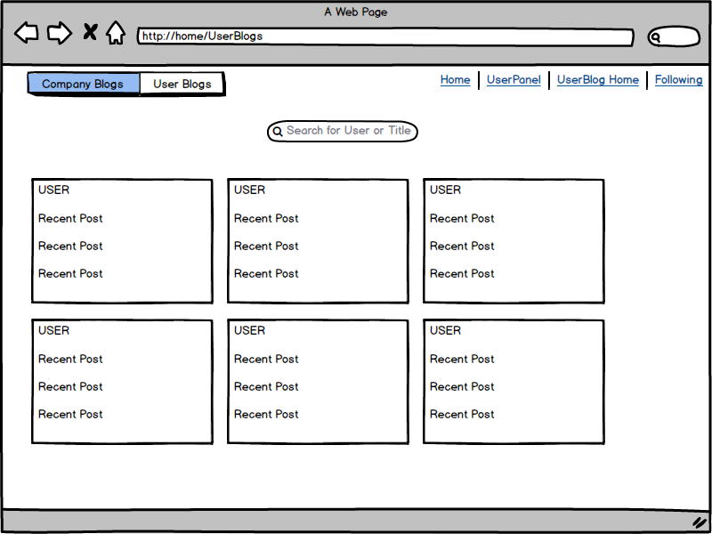
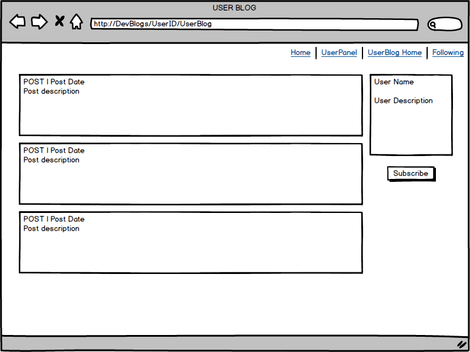
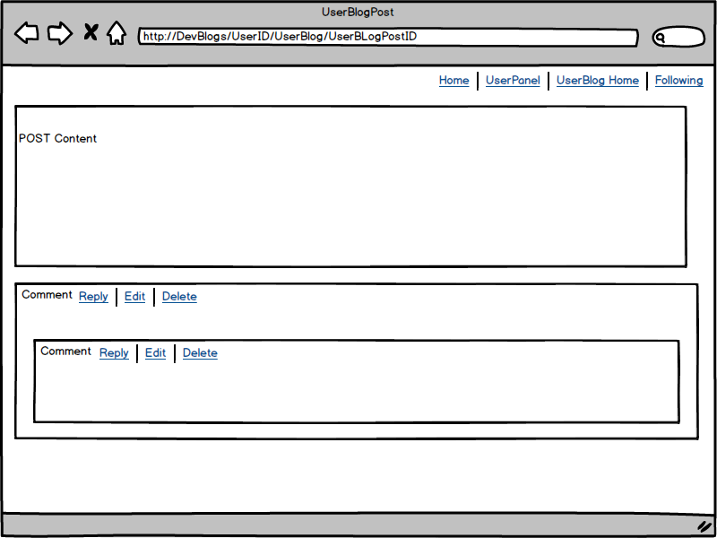

#Readme

A Front end client for Developer blogs. Built in React. 

A User will be able to read Posts from Developer Blogs of various Companies 

A User will be able to create their own blog as well as create Posts

A user will be able to Comment on Posts from Blogs or UserBlogs 

